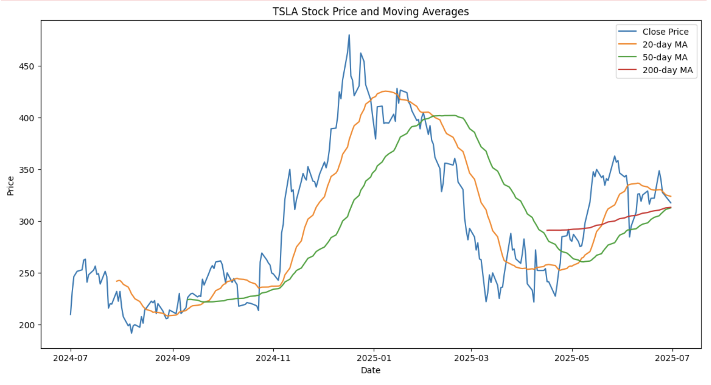

# 📈 Stock Market Trend Analyzer
This is a python-based tool that analyzes and visualizes stock price trends using technical indicators such as **moving averages** and **volatility**. It is built using **yfinance**, **pandas**, and **plotly**.

---

## 🚀 Features

- Fetches historical stock data using [Yahoo Finance](https://finance.yahoo.com/)
- Calculates: 
  - 50-day & 200-day Simple Moving Averages (SMA)  
  - Rolling Standard Deviation (Volatility)
- Visualizes price movement and indicators with interactive graphs
- Easy CLI input for stock ticker and time range

---

## 📊 Example Output

  

---

## 🧰 Tech Stack

- Python 3.x
- [yfinance](https://github.com/ranaroussi/yfinance)
- [pandas](https://pandas.pydata.org/)
- [plotly](https://plotly.com/python/)
- [matplotlib](https://matplotlib.org/)

---

## 📝 License

This project is licensed under the [MIT License](LICENSE).

---

## 🙏 Acknowledgements

- [Yahoo Finance](https://finance.yahoo.com/) for stock data
- Open-source contributors to yfinance, pandas, plotly, and matplotlib
